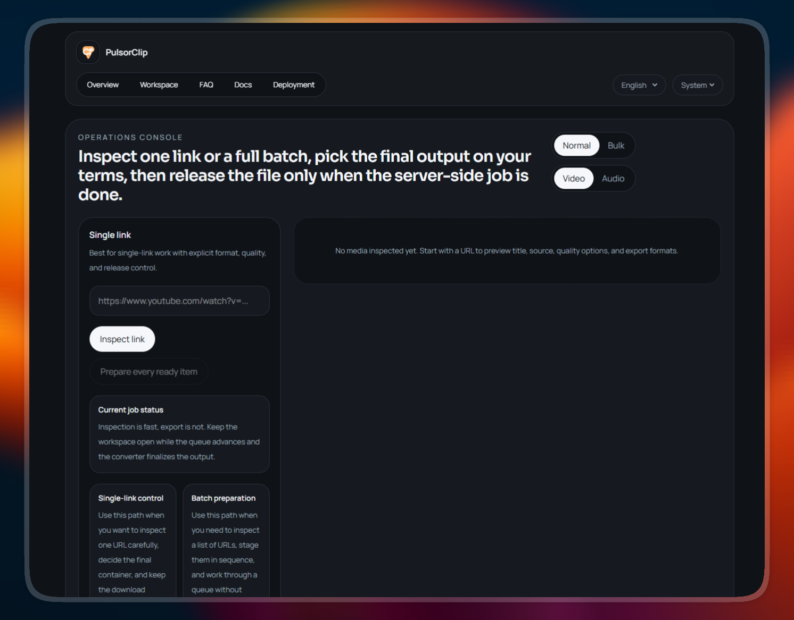

# PulsorClip

> 🌟 **Visual Showcase:** Check out the [PulsorClip Preview Gallery](preview/preview.md) to see the UI.

|                 Light Mode                 |                Dark Mode                 |
| :----------------------------------------: | :--------------------------------------: |
|  |  |

PulsorClip is a self-hosted media download and export workspace by **Adriel Zimbril**.

### 🚀 Project status
- 🌍 **Web Workspace:** ✅ 100% Functional
- 🤖 **Telegram Bot:** ✅ 100% Functional
- 🖥️ **Desktop (Native):** 🏗️ In Progress (Tauri)
- 📱 **Mobile (Native):** 🏗️ In Progress (Capacitor)

## What It Is

PulsorClip gives you a controlled workflow for media downloads:

1. load a media URL first
2. choose mode, container, and quality
3. prepare the file on your own runtime
4. download only when the final file is actually ready

It is built for self-hosting, not for running a public downloader SaaS.

## Why It Exists

- keep downloads explicit instead of automatic
- load media details before processing
- support browser and Telegram workflows from the same codebase
- stay portable enough to run on a single Docker service

## Highlights

- ⚙️ Next.js 16 App Router web app
- 🤖 Telegram bot with guided download flow
- 🌍 Cookie-based i18n with `en` and `fr`
- 🌗 Light, dark, and system themes
- 📦 Video exports: `mp4`, `webm`, `mkv`
- 🎵 Audio exports: `mp3`, `m4a`
- 🧱 Shared `yt-dlp` plus `ffmpeg` core package
- 📈 Server-side progress tracking with manual final download
- 📚 Dedicated web pages for `FAQ`, `Docs`, and `Deployment`

## Monorepo Structure

- `apps/web`
  - Next.js 16 App Router
  - cookie-based i18n
  - responsive Normal and Bulk workflows
  - FAQ, Docs, and Deployment pages
- `apps/bot`
  - Telegram bot with commands, inline keyboards, and admin notifications
  - maintenance mode support
  - guided mode, container, and quality selection
- `packages/core`
  - `yt-dlp` and `ffmpeg` orchestration
  - shared validation, progress, and i18n messages

## Runtime Requirements

PulsorClip requires:

- Node.js `22+`
- `yt-dlp`
- `ffmpeg`

For YouTube and some protected sources, authenticated cookies may also be required.

## Local Development

```bash
npm install
npm run dev:web
npm run dev:bot
```

Useful commands:

```bash
npm run lint
npm run test
npm run build
npm start
npm run start:web
npm run start:bot
```

Notes:

- `npm start` launches the combined runtime via `start:all`
- for web-only local work, set `TELEGRAM_BOT_ENABLED=false`
- startup admin notifications only work if each admin account has already opened a private chat with the bot
- use `PULSORCLIP_DEBUG_LOGS=true` when diagnosing extractor failures on YouTube, Threads, Facebook, X, TikTok, or Instagram

## Environment Files

- `.env`
  - your local runtime file
- `.env.example`
  - documented local template
- `.env.render`
  - documented Render template

Important variables:

- `NEXT_PUBLIC_APP_URL`
- `PULSORCLIP_DEBUG_LOGS`
- `PULSORCLIP_LOG_FULL_URLS`
- `TELEGRAM_BOT_ENABLED`
- `TELEGRAM_BOT_TOKEN`
- `TELEGRAM_BOT_USERNAME`
- `TELEGRAM_ADMIN_IDS`
- `TELEGRAM_MAINTENANCE_MODE`
- `YTDLP_COOKIES_FROM_BROWSER`
- `YTDLP_COOKIES_FILE`
- `YTDLP_COOKIES_BASE64`

## Deployment

Current default target: **Render free Web Service** with one Docker runtime for both web and bot.

Why this topology:

- avoids paid background workers
- keeps one deployable unit
- still supports Telegram polling and file preparation

Important limitation:

- free-tier storage is ephemeral, so prepared files can disappear after restart or redeploy

If you see this Telegram error:

```text
409 Conflict: terminated by other getUpdates request
```

another polling instance is already running with the same bot token. Keep only one polling instance active, or disable the local bot with `TELEGRAM_BOT_ENABLED=false`.

## Docs

Web pages included in the app:

- `/faq`
- `/docs`
- `/deployment`

Repository docs:

- [README.fr.md](README.fr.md)
- [docs/DEPLOYMENT.md](docs/DEPLOYMENT.md)
- [docs/TELEGRAM-BOT.md](docs/TELEGRAM-BOT.md)
- [docs/YOUTUBE-COOKIES.md](docs/YOUTUBE-COOKIES.md)

Community files:

- [CODE_OF_CONDUCT.md](CODE_OF_CONDUCT.md)
- [CONTRIBUTING.md](CONTRIBUTING.md)
- [SECURITY.md](SECURITY.md)

## CI

GitHub Actions validation is included:

- lint
- unit tests
- build

See [.github/workflows/ci.yml](.github/workflows/ci.yml).

## Platforms

| Platform | Status | Extraction Method |
| :--- | :--- | :--- |
| **Threads** | ✅ Stable | Custom JSON Scraper (up to 1280p) |
| **TikTok** | ✅ Stable | Tikwm API + Carousel Fallback |
| **Instagram** | ✅ Stable | `yt-dlp` + direct CDN fallback |
| **Facebook** | ✅ Stable | `yt-dlp` |
| **X / Twitter** | ✅ Stable | `yt-dlp` |
| **YouTube** | ⚠️ Restricted | Stable locally. **"Sign in to confirm"** errors common on VPS/Datacenter IPs. Use authenticated cookies to bypass. |

## Legal & Educational Disclaimer

**PulsorClip is an educational and research project.** 

It is designed to explore media extraction concepts and self-hosting architectures. The author(s) do not encourage or condone the unauthorized downloading, distribution, or storage of copyrighted material. 

- **User Responsibility:** Users are solely responsible for their actions and must ensure compliance with the terms of service of the target platforms and local copyright laws (DMCA, etc.).
- **Notice:** This software is provided "as is", without warranty of any kind. The authors are not responsible for any legal consequences or liability arising from the use or misuse of this software.

## Docs
... (rest of the file remains as is)
