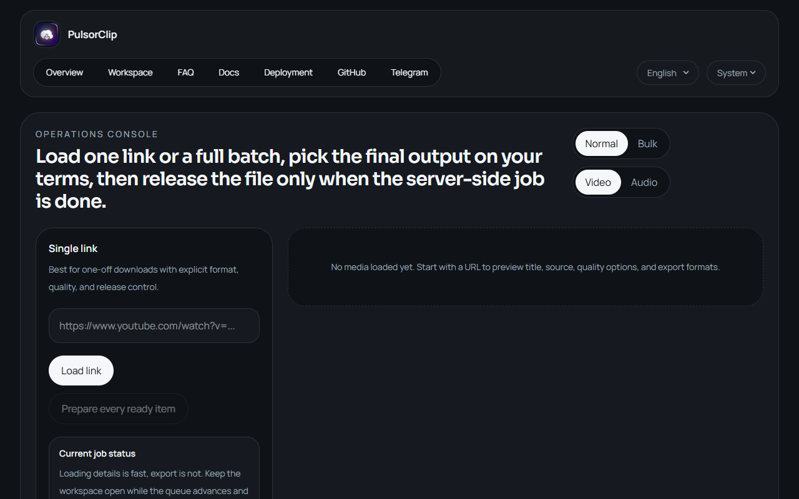

# PulsorClip Previews 🌟

Welcome to the visual tour of PulsorClip! Below you will find the screenshots of our beautiful media downloading interface.

### Home Interface

*The modern, clean interface allows any user to quickly paste Media URLs from YouTube, TikTok, X (Twitter), and Threads.*

### Features
- Support for multiple social media platforms.
- Ultra fast downloading logic powered by yt-dlp.
- Support for both bots and web interactions.

*(More screenshots can be added here once generated).*
